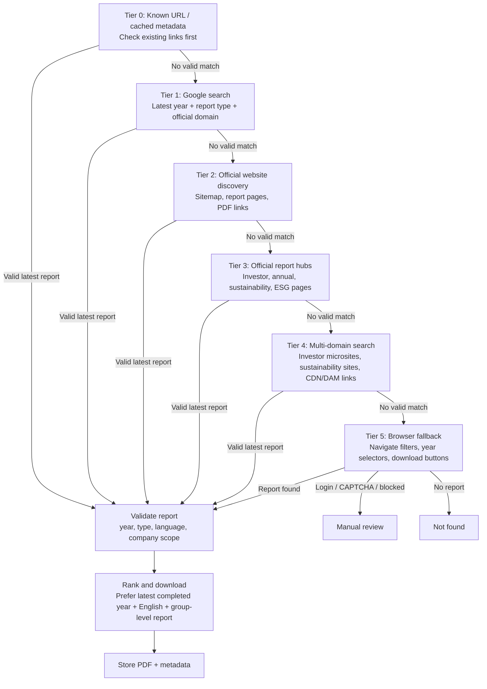

```mermaid
flowchart TD
    T0["Tier 0: Known URL / cached metadata<br/>Check existing links first"] -->|Valid latest report| V["Validate report<br/>year, type, language, company scope"]
    T0 -->|No valid match| T1["Tier 1: Google search<br/>Latest year + report type + official domain"]

    T1 -->|Valid latest report| V
    T1 -->|No valid match| T2["Tier 2: Official website discovery<br/>Sitemap, report pages, PDF links"]

    T2 -->|Valid latest report| V
    T2 -->|No valid match| T3["Tier 3: Official report hubs<br/>Investor, annual, sustainability, ESG pages"]

    T3 -->|Valid latest report| V
    T3 -->|No valid match| T4["Tier 4: Multi-domain search<br/>Investor microsites, sustainability sites, CDN/DAM links"]

    T4 -->|Valid latest report| V
    T4 -->|No valid match| T5["Tier 5: Browser fallback<br/>Navigate filters, year selectors, download buttons"]

    T5 -->|Report found| V
    T5 -->|Login / CAPTCHA / blocked| M["Manual review"]
    T5 -->|No report| N["Not found"]

    V --> R["Rank and download<br/>Prefer latest completed year + English + group-level report"]
    R --> S["Store PDF + metadata"]
```