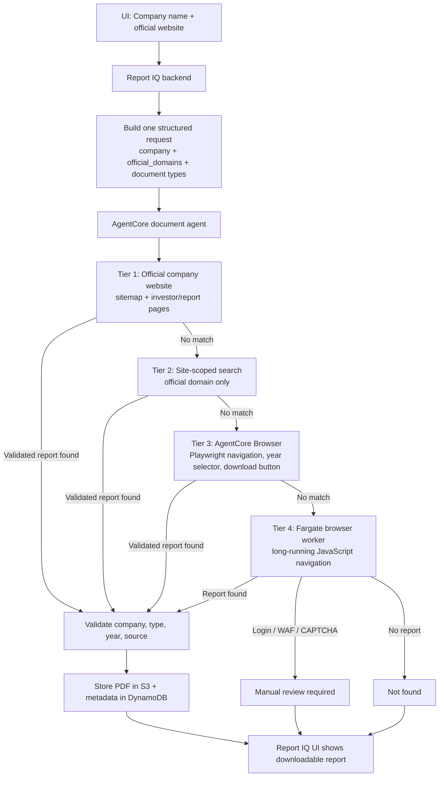

# Report Retrieval Flow

```mermaid
flowchart TD
    A["UI: Company name + official website"] --> B["Report IQ backend"]
    B --> C["Build one structured request<br/>company + official_domains + document types"]
    C --> D["AgentCore document agent"]

    D --> T1["Tier 1: Official company website<br/>sitemap + investor/report pages"]
    T1 -->|"Validated report found"| V["Validate company, type, year, source"]
    T1 -->|"No match"| T2["Tier 2: Site-scoped search<br/>official domain only"]

    T2 -->|"Validated report found"| V
    T2 -->|"No match"| T3["Tier 3: AgentCore Browser<br/>Playwright navigation, year selector, download button"]

    T3 -->|"Validated report found"| V
    T3 -->|"No match"| T4["Tier 4: Fargate browser worker<br/>long-running JavaScript navigation"]

    T4 -->|"Report found"| V
    T4 -->|"Login / WAF / CAPTCHA"| M["Manual review required"]
    T4 -->|"No report"| N["Not found"]

    V --> S["Store PDF in S3 + metadata in DynamoDB"]
    S --> R["Report IQ UI shows downloadable report"]
    M --> R
    N --> R
```

Only a report that passes source, company, document-class, and requested-year
validation is stored. Browser tiers never bypass login, CAPTCHA, or WAF controls.
