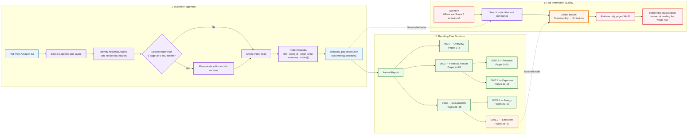

```mermaid
flowchart LR
    subgraph BUILD["1. Build the PageIndex"]
        PDF["PDF from Amazon S3"] --> READ["Extract page text and layout"]
        READ --> ANALYZE["Identify headings, topics and section boundaries"]
        ANALYZE --> SIZE{"Section larger than<br/>5 pages or 8,000 tokens?"}

        SIZE -- "Yes" --> SPLIT["Recursively split into child sections"]
        SIZE -- "No" --> NODE["Create index node"]
        SPLIT --> NODE

        NODE --> META["Node metadata<br/>title · node_id · page range<br/>summary · nodes[]"]
        META --> JSON["company_pageindex.json<br/>documents[].structure[]"]
    end

    subgraph TREE["2. Resulting Tree Structure"]
        JSON --> ROOT["Annual Report"]

        ROOT --> OVERVIEW["0001 — Overview<br/>Pages 1–3"]
        ROOT --> FINANCE["0002 — Financial Results<br/>Pages 4–28"]
        ROOT --> ESG["0003 — Sustainability<br/>Pages 29–45"]

        FINANCE --> REVENUE["0002.1 — Revenue<br/>Pages 5–10"]
        FINANCE --> EXPENSES["0002.2 — Expenses<br/>Pages 11–18"]

        ESG --> ENERGY["0003.1 — Energy<br/>Pages 30–33"]
        ESG --> EMISSIONS["0003.2 — Emissions<br/>Pages 34–37"]
    end

    subgraph SEARCH["3. Find Information Quickly"]
        QUESTION["Question<br/>Where are Scope 1 emissions?"]
        MATCH["Search node titles and summaries"]
        BRANCH["Select branch<br/>Sustainability → Emissions"]
        PAGES["Retrieve only pages 34–37"]
        RESULT["Return the exact section<br/>instead of reading the whole PDF"]

        QUESTION --> MATCH --> BRANCH --> PAGES --> RESULT
    end

    JSON -. "Searchable index" .-> MATCH
    EMISSIONS -. "Matched node" .-> BRANCH

    classDef source fill:#eaf4ff,stroke:#147eba,stroke-width:2px
    classDef process fill:#f3ecff,stroke:#7c3aed,stroke-width:2px
    classDef tree fill:#ecf8ea,stroke:#248224,stroke-width:2px
    classDef selected fill:#fff4e8,stroke:#ed7100,stroke-width:3px
    classDef result fill:#fff0f2,stroke:#dd344c,stroke-width:2px

    class PDF,JSON source
    class READ,ANALYZE,SIZE,SPLIT,NODE,META,MATCH process
    class ROOT,OVERVIEW,FINANCE,REVENUE,EXPENSES,ESG,ENERGY tree
    class EMISSIONS,BRANCH selected
    class QUESTION,PAGES,RESULT result
```